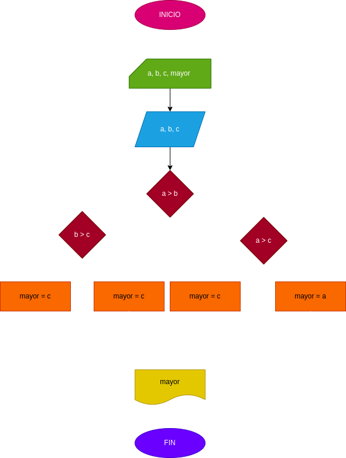

# EJERCICIO 1 ESTRUCTURAS CONDICIONALES 

## programa para hallar el mayor de 3 numeros enteros 

## ANALISIS

### Definicion de variables 

* a: primer numero 
* b: segundo numero 
* c: tercer numero
* mayor: numero mayor 

se comparan los 2 valores entre si para hallar el mas grande

## DISEÑO 

